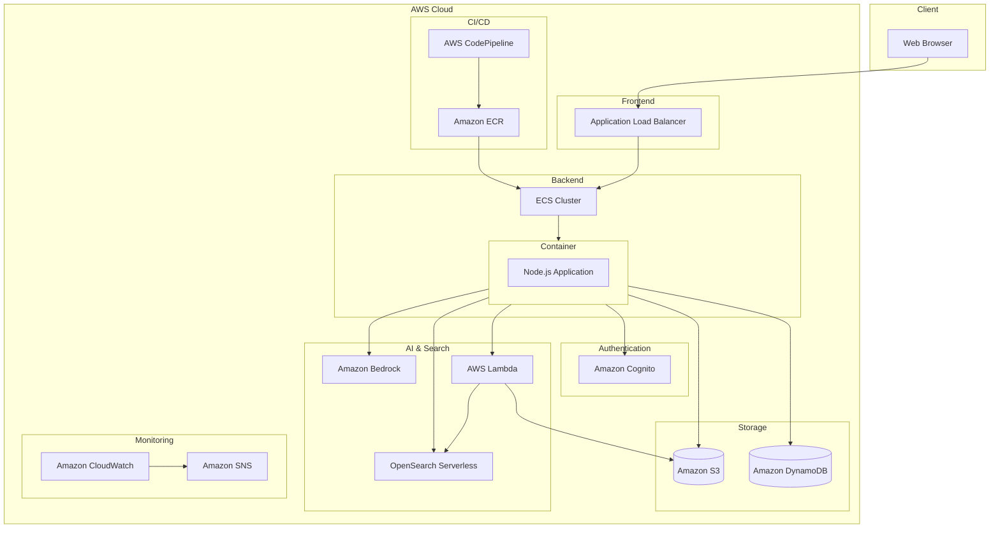

# 1.2 システム構成図

## システムアーキテクチャ



## コンポーネント説明

### 1. クライアント層
- **Web Browser**: ユーザーインターフェース
  - チャットインターフェース
  - ドキュメントアップロード
  - ユーザー設定

### 2. ロードバランシング層
- **Application Load Balancer**
  - HTTPS終端
  - リクエストの分散
  - ヘルスチェック

### 3. アプリケーション層
- **ECS Cluster**
  - Fargate起動タイプ
  - 自動スケーリング
  - コンテナ化されたNode.jsアプリケーション

### 4. 認証層
- **Amazon Cognito**
  - ユーザープール管理
  - メール/パスワード認証
  - セッション管理

### 5. ストレージ層
- **Amazon S3**
  - ドキュメント保存
  - 署名付きURL生成
  - バージョニング

- **Amazon DynamoDB**
  - ユーザー設定
  - チャット履歴
  - ドキュメントメタデータ

### 6. AI & 検索層
- **Amazon Bedrock**
  - Claude 3 Sonnetモデル
  - 自然言語処理
  - 応答生成

- **OpenSearch Serverless**
  - ドキュメント検索
  - ベクトル検索
  - セマンティック検索

- **AWS Lambda**
  - ドキュメント処理
  - テキスト抽出
  - ベクトル化

### 7. 監視層
- **Amazon CloudWatch**
  - メトリクス収集
  - ログ管理
  - アラート設定

- **Amazon SNS**
  - アラート通知
  - メール配信

### 8. CI/CD層
- **AWS CodePipeline**
  - ソースコード管理
  - ビルド
  - デプロイ

- **Amazon ECR**
  - コンテナイメージ管理
  - バージョン管理

## データフロー

1. **ユーザー認証フロー**
   ```
   Web Browser -> ALB -> ECS -> Cognito
   ```

2. **チャットフロー**
   ```
   Web Browser -> ALB -> ECS -> Bedrock
   ECS -> OpenSearch -> Bedrock
   ```

3. **ドキュメント処理フロー**
   ```
   Web Browser -> ALB -> ECS -> S3
   S3 -> Lambda -> OpenSearch
   ```

4. **監視フロー**
   ```
   ECS -> CloudWatch -> SNS -> Email
   ```

## セキュリティ考慮事項

1. **ネットワークセキュリティ**
   - VPC内でのリソース配置
   - セキュリティグループによるアクセス制御
   - HTTPS通信の強制

2. **データセキュリティ**
   - S3バケットポリシー
   - IAMロールとポリシー
   - 暗号化（転送時・保存時）

3. **アプリケーションセキュリティ**
   - Cognito認証
   - 署名付きURL
   - 入力値バリデーション 